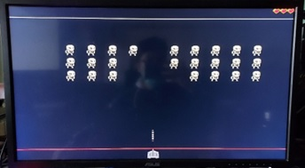
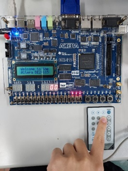
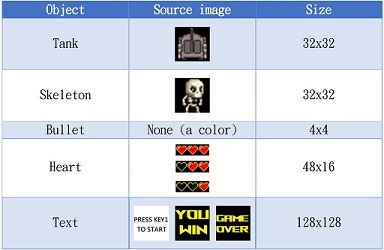
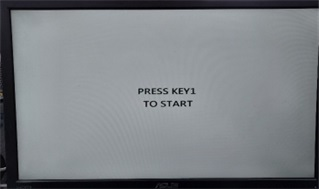
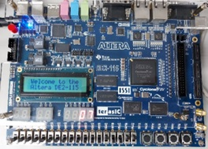
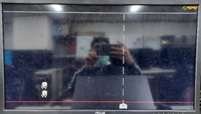
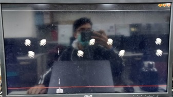
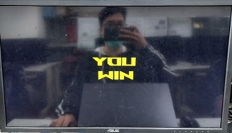
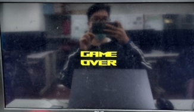

# A mini game on FPGA
## 1. Introduction
A game running on FPGA which takes the buttons on the board as input and the screen as output. This game imitates the classical game named "Galaxian", which goal is to shoot all the approaching aliens. The game has basic elements that a game needed, such as scoring, three lifes (more chance) and difficulty. All mechanisim is implemented only by logic gates.

  

  

## 2. Hardware
1. FPGA board: DE2-115

2. IR module (embedded on the board)

3. Remote control

4. VGA monitor

  

 

## 3. Description
At the begining, the game will wait for the button START to be pressed, but before that, we can change the diffculty, speed of tank, shooting frequency through the switches or the remote control. When the game starts, the circuit would generate 30 skeletons moving left and right and approaching the baseline. We can use the buttons to control the automatically shooting tank in order to eliminate all the skeletons. Then we will get in the second stage, which means the skeleton now would move in a irregular way and more difficult to win.

## 4. Algorithm

  

 
<h5 align="center">Images stored in BRAM</h1>

### 1. Display:
All the objects is displayed by raster scan, when the scan pointer is inside of an object's area, the circuit will calculate the relative address in its memory and bring out the correct pixel for output RGB.
### 2. Disappear:
Since we can not delete registers, the way skeletons disapear is to hide them, which is making their position to be (0,0), and the top left of the screen is designed to only display black. In addition, the bullets are dynamically hided inside the tank.
### 3. Generate:
Since we can not generate registers, the way bullets are generated is to reuse them, we have a total of 20 bullets, each one has its allowed shooting time, in that time they are allowed to only shooted once, and when they hit any object they will be recycled (stay inside the tank).
### 4. Others:
In the second episode, there is a virtual line which limits the speed of skeleton moving down. 
Changing the game parameters (difficulty, etc.) is just simply change the speed of counters for each object.
When a skeleton touch the baseline, we will lost 1 heart 10 score, which is display on the screen or 7 segment LED.

## 5. Result

  

 
<h5 align="center">Welcome</h1>

  

 
<h5 align="center"Episode 1</h1>

  

 
<h5 align="center">Scoring</h1>

  

<h5 align="center">Deducted heart</h1>

  

 <h5 align="center">Episode 2</h1>

  

 
<h5 align="center">Win</h1>

  

 
<h5 align="center">Lose</h5>
  
<h5 align="center"> [Video link](https://tinyurl.com/29x9wc6n) </h5> 
